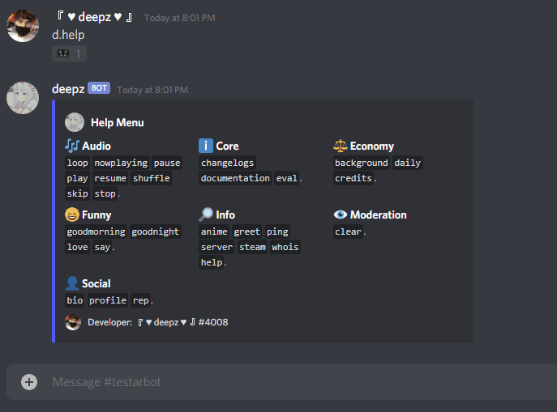
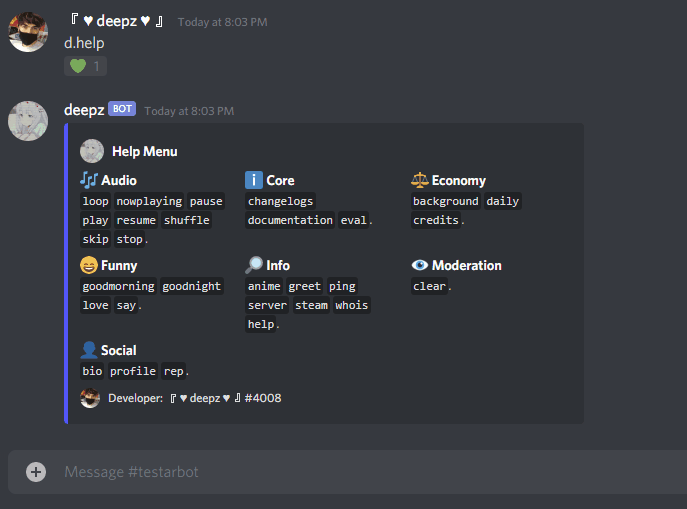
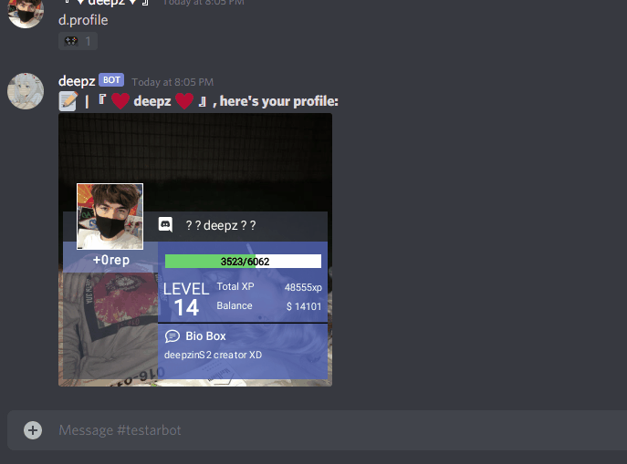
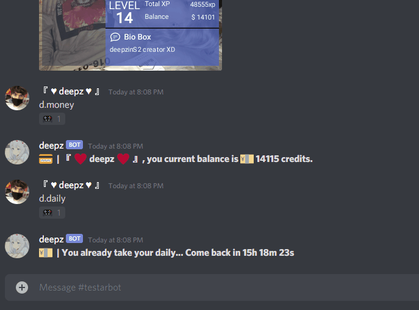
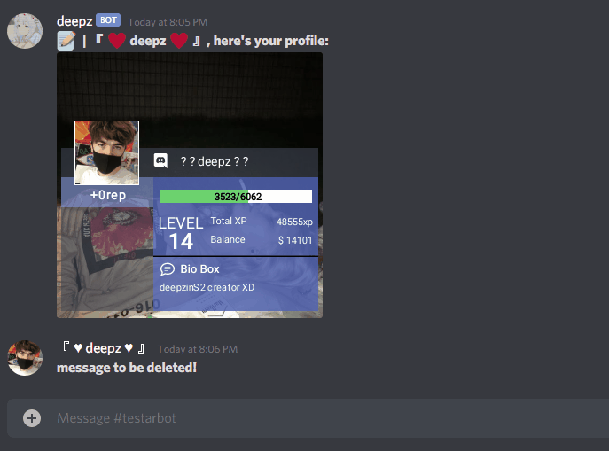
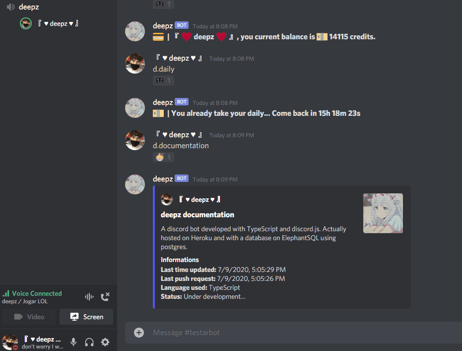

# [deepz BOT](https://discord.com/oauth2/authorize?client_id=709564503053828137&scope=bot&permissions=334621766)    

"deepz BOT" is a bot developed with [TypeScript](https://www.typescriptlang.org/) and [discord.js](https://www.discord.js.org/), based on [Tatsu](https://tatsu.gg/) and other BOTS.

#### Status - Under development...

## Idea
My first idea was trying to make the bot like the Tatsu BOT, but my idea changed to implement other functions and commands when i decided to make a website for the bot. Actually the bot is under development and hosted on Heroku.

## Host
The bot is hosted on [Heroku](https://www.heroku.com/) *for free*, on this pandemic I, the developer, don't have the money to host it on another host or paying the actual host.

## Database
- [ElephantSQL](https://www.elephantsql.com/)

## Commands categories list
- [Audio](src/commands/audio) - The bot can play music;
- [Core](src/commands/core) - For the bot developing and documentation for the users;
- [Economy](src/commands/economy) - Economy system actually stored on ElephantSQL using postgres;
- [Funny](src/commands/funny) - Funny commands;
- [Information](src/commands/info) - Information commands, like `help`, etc.;
- [Moderation](src/commands/moderation) - For moderating the discord guild;
- [Social](src/commands/social) - XP, profile, bio, etc. stored on ElephatnSQL.

## In Action!
**The bot is under development and will be upgraded ASAP.**

