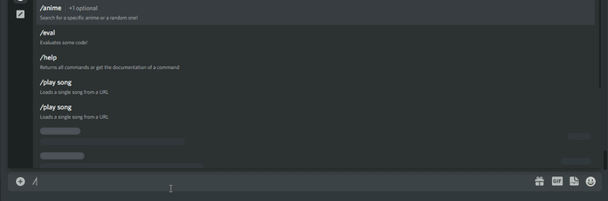
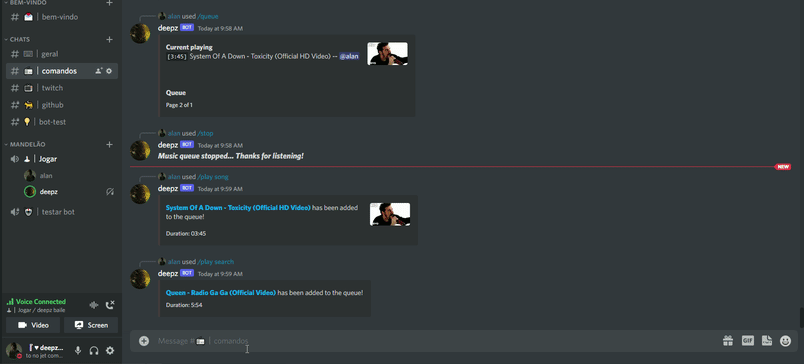

<h1 align="center">
  <a href="https://discord.com/oauth2/authorize?client_id=709564503053828137&scope=bot&permissions=334621766">deepzBOT</a>
</h1>

  
  
  
  

  <b>deepzBOT</b> is a bot developed with <a href="https://www.typescriptlang.org/">TypeScript</a> and <a href="https://www.discord.js.org/">discord.js</a>, based on <a href="https://tatsu.gg/">Tatsu</a> and other BOTS.

## Idea
My first idea was trying to make the bot like the Tatsu BOT, but then I changed it a little bit to implement other functions and commands that i thought will be useful to the final user.

## Status
Currently the bot is maintained by a single contributor which is [Alan](https://github.com/deepzS2) and is hosted on [AWS EC2 instance](https://aws.amazon.com/pt/ec2/), but before it was hosted on [Heroku](https://www.heroku.com)!

## Features
With the new versions of Discord, they created something amazing called [Slash commands](https://discordjs.guide/interactions/slash-commands.html) which gives the ability to the user of using commands with interactions like buttons, selects menus, etc. In this version of the BOT, it only uses slash commands implemented since it's so easy and funny to create and interact with the user now!

## Stack
- [MongoDB](https://www.mongodb.com)
- [Typescript](https://www.typescriptlang.org/)
- [Discord.js](https://www.discord.js.org/)
- [Docker](https://www.docker.com)

## Commands categories list
- [x] [Audio](src/commands/audio) - The bot can play music;
- [x] [Core](src/commands/core) - For the bot developing and documentation for the users;
- [x] [Economy](src/commands/economy) - Economy system actually stored on database;
- [x] [Funny](src/commands/funny) - Funny commands;
- [x] [Information](src/commands/info) - Information commands, like `help`, etc.;
- [x] [Moderation](src/commands/moderation) - For moderating the discord guild;
- [x] [Social](src/commands/social) - XP, profile, bio, etc. stored on database.

## In action!
|  |
| :--: |
| *Playing music* |

|  |
| :--: |
| *Help command* |

## Show your support
Give this project a ⭐ if you like to support me to make more projects like this!